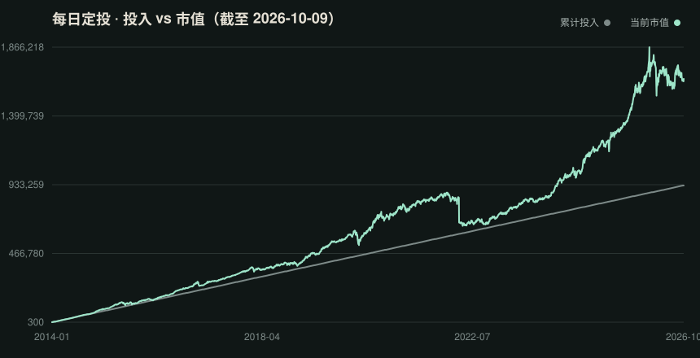
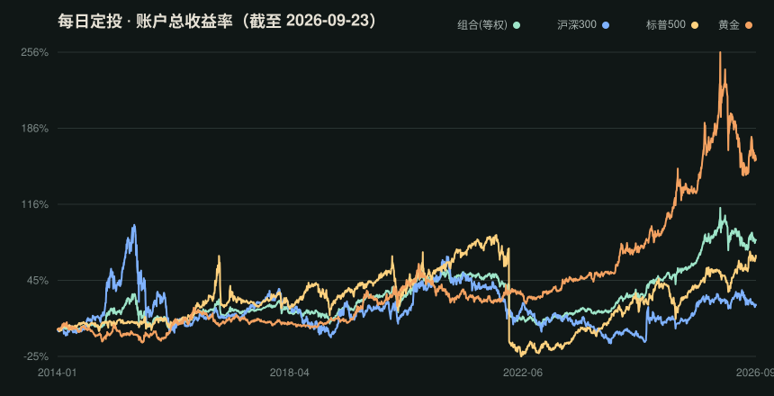

# Mahoupao (马后炮)

[中文文档](README.md) · English

A daily-updating ETF accumulation ledger: it pulls real Tushare quotes, computes returns for a "fixed daily after-close contribution" strategy, and publishes CSV snapshots plus invested-vs-value and account-return charts to this repo. The website displays the same public data rather than maintaining a separate backtest.

**[Open the index website ↗](https://mahoupao-index.leiwu3.workers.dev)** · Index readings and daily direction, interactive history, the portfolio ledger, and methodology, with mobile support. It reads the repository's daily-updated data directly; see [`website/README.md`](website/README.md) for development and deployment instructions.

## Daily Data Snapshot

The charts below are regenerated automatically by GitHub Actions every day from real Tushare data.

### Mahoupao index (number: cumulative return; color: daily direction)

  

Index = `(current value ÷ total invested − 1) × 100`: the cumulative return's percentage number without the percent sign. **Badge numbers show the current index without `%`; colors show its direction since the previous trading day**: red for an increase, green for a decrease, and gray for no change or no previous observation.

### Invested vs value (equal-weight portfolio)



### Account return



> Methodology: 100 CNY is invested at each day's close into each asset; returns are real-account returns (current value ÷ total invested − 1). Data is as of the latest trading day, and the update is skipped automatically on weekends/holidays when there is no new data.

## Data Files

- `data/export/csi300.csv` / `spx.csv` / `gold.csv` — per-asset daily OHLCV snapshots (preview/diff/download)
- `data/export/daily_returns.csv` — invested, current value, account return and daily change per asset + equal-weight portfolio
- `data/export/badge-csi300.svg` / `badge-spx.svg` / `badge-gold.svg` — per-asset index shield badges (cumulative percentage numbers without `%`; color indicates daily direction)
- `data/export/nav.svg` / `returns.svg` — invested-vs-value chart and account-return chart

## Intuition

### Why “Mahoupao” — hindsight?

Looking at a historical chart, it is easy to say, “I should have bought back then.” Picking the bottom benefits from hindsight. Mahoupao asks a different question that requires no entry-point selection:

> **What if, from a specified starting date, I had invested the same amount every trading day, without predicting prices or selling? What would that account look like today?**

This is the ledger of a hypothetical, strictly rule-following investor, not an estimate of actual investors' average performance or a backtest of the best possible entry point.

### From market price to accumulated cost

A market price tells you what one unit costs now. This index tells you how far that price stands above or below the average cost accumulated by this particular DCA account.

Equal cash contributions buy more units at lower prices and fewer at higher prices. Two histories ending at the same price can therefore produce different holdings, average costs, and index readings. The index retains **the account's cost history since a fixed starting date**, rather than describing today's price alone.

For one ETF, let `P_i` be the closing price on trading day `i`, `a` the fixed daily contribution, and `n` the number of contributions:

```text
Units held Q = Σ(a / P_i)
Total invested I = n × a
Current value V = P_n × Q
Average cost per unit C = I / Q = n / Σ(1 / P_i)
Mahoupao index M = 100 × (V / I − 1) = 100 × (P_n / C − 1)
```

The average cost is the **harmonic mean** of past closing prices, not their arithmetic mean. Under the current fractional-share model, ignoring fees and other adjustments, `a` cancels out: investing 10 rather than 100 CNY daily changes the account's size, not its index reading.

### Reading the index and the badge

The index is the cumulative return's percentage number without `%`. **Zero means breakeven**; this is not a conventional price index starting at 100 or 1,000:

| Index | Account interpretation |
|---|---|
| `20` | A cumulative return of 20%; every 100 CNY contributed is now worth 120 CNY on average |
| `0` | Current value equals total contributions |
| `−10` | A cumulative return of −10%; every 100 CNY contributed is now worth 90 CNY on average |

**The badge number describes cumulative profit or loss; its color shows the direction since the previous trading day:**

- From `20` to `19`: green `+19.00`. The cumulative return is 19%; green means the reading declined, even though the account remains profitable.
- From `−10` to `−9`: red `−9.00`. The cumulative return is −9%; red means the reading increased, even though the account remains underwater.
- No change or no previous observation: the current index is still displayed, in gray.

**The number is neither the difference between two days nor the ETF's daily return. Its sign indicates cumulative profit or loss; its color indicates daily direction.** A positive number can be green and a negative number can be red. Chart and CSV fields labeled as returns retain their percentage convention.

One subtlety: new contributions increase invested capital without generating profit or loss at the moment of purchase. Even with an unchanged price, a contribution pulls the existing cumulative return toward zero. Index changes (and hence badge colors) therefore reflect both price movements and contributions; they are not a direct measure of the day's cash profit or loss.

### What it does — and does not — tell you

The index describes the historical account experience of applying the same contribution rule to different assets: money invested, current value, and profit or loss relative to accumulated cost. The portfolio reading uses total account value divided by total contributions. Equal contributions do not keep market-value weights equal and do not imply periodic rebalancing.

It is not an annualized return, a valuation verdict, or a measure of actual investors' holdings or sentiment. **A high reading does not mean “sell”; a low reading does not mean “buy.”** Predictive value requires separate testing. Starting dates, contribution rules, and price histories affect readings and must be kept consistent when comparing results.

This remains a simplified historical simulation using ETF closing prices, without fees, cash dividends, or share split/consolidation adjustments. It is not a complete total-return measure of fund NAV or the underlying index. The name is a reminder: **describe what happened; do not dress hindsight up as foresight.**

## Backtest Methodology

- Default start: `2014-01-15`, the earliest common history of the three ETFs
- Each asset uses its own trading calendar; non-trading days are not settled
- Settlement and valuation happen once per day at the closing price
- CSI 300: `510300.SH`, Huatai-PineBridge CSI 300 ETF
- S&P 500: `513500.SH`, Bosera S&P 500 ETF (QDII)
- Gold: `518880.SH`, Huaan Yifu Gold ETF

This version allows fractional shares at a fixed amount, ideal for observing the "100 CNY per day" wealth curve. Real on-exchange trading also involves 100-share lots, fees, dividends and premium/discount.

## GitHub Actions Daily Update

The repo ships with `.github/workflows/daily-update.yml`, which runs daily around 20:30 Beijing time:

1. Incrementally pulls new Tushare quotes
2. Recomputes daily returns
3. Commits the updated CSV + SVG under `data/export/`

First-time setup:

1. Add `TUSHARE_TOKEN` under `Settings → Secrets and variables → Actions`
2. (Optional) trigger once manually: `Actions → Daily update → Run workflow`

On weekends/holidays with no new data the workflow skips committing.

## Running Locally

```bash
cp .env.example .env
# edit .env and fill in your Tushare Pro token
python3 sync_and_report.py
```

The script incrementally pulls new quotes and regenerates the CSV + SVG files under `data/export/`.

Tushare API reference:

- [ETF daily quotes](https://tushare.pro/document/2?doc_id=127)
- [Mutual fund list](https://tushare.pro/document/1?doc_id=19)
- [HTTP API](https://tushare.pro/document/1?doc_id=40)
