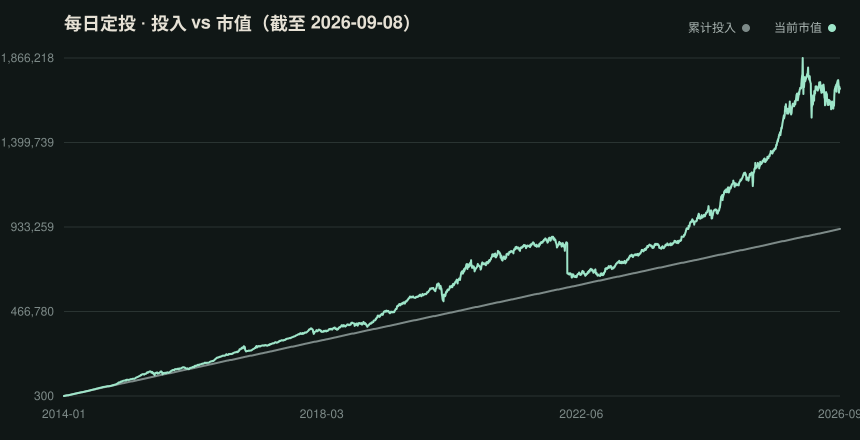
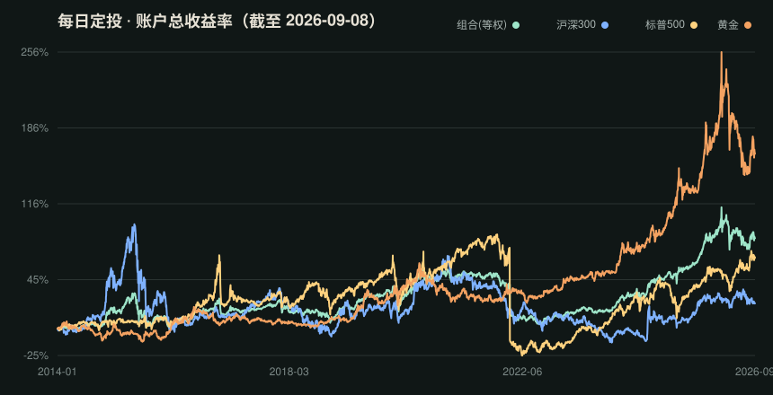

# 马后炮 / Mahoupao

中文 · [English](README.en.md)

一个每日自动更新的 ETF 定投数据管道：拉取 Tushare 真实行情，核算「每日收市固定投入」的收益率，并把行情快照（CSV）与净值/收益率曲线图（SVG）发布到本仓库。数据是本仓库唯一关注的内容。

## 每日数据快照

下面的图表由 GitHub Actions 每天自动更新，数据来自 Tushare 真实行情。

### 净值曲线（等权组合 + 三只标的）



### 累计收益率



> 口径：每日收市后按收盘价每只投入 100 元；净值/收益率均排除追加资金影响。数据截至最近一个交易日，周末/节假日无新数据时自动跳过。

## 数据文件

- `data/export/csi300.csv` / `spx.csv` / `gold.csv`：三只 ETF 各自的完整日线行情快照（OHLCV，可预览/diff/下载）
- `data/export/daily_returns.csv`：每只标的 + 等权组合的每日收益率、累计收益率、净值
- `data/export/nav.svg` / `returns.svg`：净值与收益率曲线图

## 回测口径

- 默认起点：`2014-01-15`，三只 ETF 的共同历史起点
- 每个标的使用自己的交易日历；非交易日不结算
- 每个交易日收市后按收盘价完成一次结算和估值
- 沪深300：`510300.SH`，华泰柏瑞沪深300ETF
- 标普500：`513500.SH`，博时标普500ETF(QDII)
- 黄金：`518880.SH`，华安易富黄金ETF

这版按固定金额允许买入小数份额，适合观察“每天投入100元”的资金曲线；真实场内交易通常还要考虑100份整数手、手续费、分红和申赎/折溢价。

## GitHub Actions 每日更新

仓库自带 `.github/workflows/daily-update.yml`，每天北京时间 20:30 左右自动运行：

1. 增量拉取 Tushare 新行情
2. 重新核算每日收益率
3. 更新 `data/export/` 下的 CSV 与 SVG 并提交

首次使用只需两步：

1. 在仓库 `Settings → Secrets and variables → Actions` 添加 `TUSHARE_TOKEN`
2. （可选）手动触发一次：`Actions → Daily update → Run workflow`

周末/节假日无新数据时，workflow 会自动跳过提交。

## 本地运行

```bash
cp .env.example .env
# 编辑 .env，填入你的 Tushare Pro Token
python3 sync_and_report.py
```

脚本会增量拉取新行情，并重新生成 `data/export/` 下的 CSV 与 SVG。

Tushare 接口说明：

- [ETF日线行情](https://tushare.pro/document/2?doc_id=127)
- [公募基金列表](https://tushare.pro/document/1?doc_id=19)
- [HTTP 调取方式](https://tushare.pro/document/1?doc_id=40)
